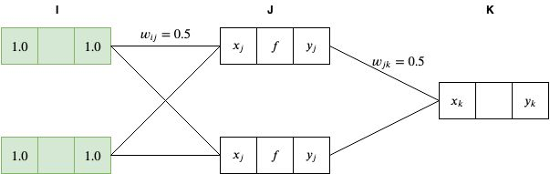
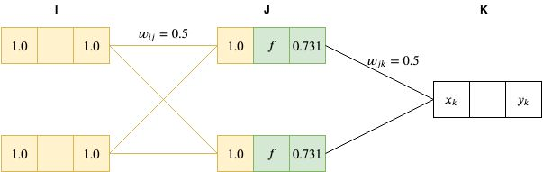
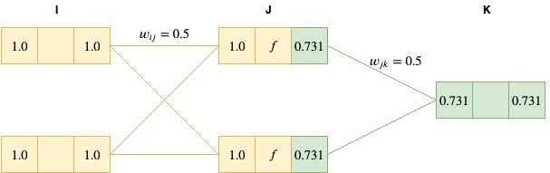

# Backpropagation algorithm

Backpropagation is a technique used to teach a neural network that has at least one hidden layer. 

## This is part 2 of a series of github repos on neural networks

- [part 1 - linear associative network](https://github.com/gokadin/ai-linear-associative-network)
- part 2 - backpropagation (**you are here**)

## Table of Contents

- [Theory](#theory)  
  - [Introducing the perceptron](#introducing-the-perceptron)
  - [Backpropagation](#backpropagation)
    - [Notation](#notation)
    - [The forward pass](#the-forward-pass)
    - [The backward pass](#the-backward-pass)
  - [Algorithm summary](#algorithm-summary)
  - [Visualizing backpropagation](#visualizing-backpropagation)
    - [Forward pass](#forward-pass)
    - [Backward pass](#backward-pass)
- [Code example](#code-example)
- [References](#references)

## Theory

### Introducing the perceptron

A perceptron is a processing unit that takes an input , transforms it using an activation function  and outputs the result . 

Just as we saw in *part 1*, its input is the sum of the previous layer node outputs times their corresponding weight, plus the previous layer bias unit times its weight:

If we treat the bias as an additional node in a layer with a constant value of , then we can simplify the equation:

#### Some activation functions

If  then typical activation functions are:

- Sigmoid 

- ReLU or rectified linear unit 

- tanh 

### Backpropagation

The backpropagation algorithm is used to train artificial neural networks, more specifically those with more than two layers. 

It's using a forward pass to compute the outputs of the network, calculates the error and then goes backwards towards the input layer to update each weight based on the error gradient. 

#### Notation

- , are inputs to a node for layers  respectively. 
- , are the outputs from a node for layers  respectively. 
-  is the expected output of a node of the  output layer. 
-  are weights of node connections from layer  to  and from layer  to  respectively.
-  is the current association out of  associations. 

We will assign the following activation functions to each layer perceptrons for all following examples:

- input layer -> identity function
- hidden layer -> sigmoid function
- output layer -> identity function

#### The forward pass

During the forward pass, we feed the inputs to the input layer and get the results in the output layer. 

The input to each perceptron in the hidden layer  is the sum of all perceptron of the previous layer times their corresponding weight:

However, since our hidden layer's activation function for each perceptron is the sigmoid, then their output will be: 

In the same manner, the input to the output layer perceptrons are

and their output is the same since we assigned them the identity activation function. 

Once the inputs have been propagated through the network, we can calculate the error:

#### The backward pass

Now that we have the error, we can use it to update each weight of the network by going backwards layer by layer. 

We know from *part 1* that the change of a weight is the negative of that weight's component in the error gradient times the learning rate. For a weight between the last hidden layer and the output layer, we then have

We can find the error gradient by using the chain rule

Similarly, for a weight between hidden layers, in our case between the input layer and our first hidden layer, we have

Here the calculations are *slightly* more complex. Let's analyze the delta term  and understand how we got there. We start by calculating the partial derivative of  in respect to the error by using the chain rule

Remember that our activation function  is the sigmoid function and that its derivative is 

The change of a weight for  associations is the accumulation of each association

### Algorithm summary

First, initialize network weights to a small random value. 

Repeat the steps below until the error is about 

- for each association, propagate the network forward and get the outputs
  - calculate the  term for each output layer node ()
  - accumulate the gradient for each output weight ()
  - calculate the  term for each hidden layer node ()
  - accumulate the gradient for each hidden layer weight ()
- update all weights and reset accumulated gradients ()

### Visualizing backpropagation

In this example, we'll use actual numbers to follow each step of the network. We'll feed our 2x2x1 network with inputs  and we will expect an output of . To make matters simpler, we'll initialize all of our weights with the same value of . However, keep in mind that normally weights are initialized using random numbers. We will also design the network with a sigmoid activation function for the hidden layer and the identity function for the input and output layers. 

#### Forward pass

We start by setting all of the nodes of the input layer with the input values; . 

Since the input layer nodes have no activation function, then . 

We then propagate the network forward by setting the  layer node inputs () with the sum of all of the previous layer node outputs times their corresponding weights:

We then activate the  layer nodes by passing it's inputs to the sigmoid function 

And we propagate those results to the final layer 

Since we didn't assign an activation function to our output layer node, then 

#### Backward pass

...

## Code example

The example teaches a 2x2x1 network the XOR operator. 

Where  is the sigmoid function for the hidden layer nodes. 

## References

- Artificial intelligence engines by James V Stone (2019)
- http://neuralnetworksanddeeplearning.com/chap2.html
- https://google-developers.appspot.com/machine-learning/crash-course/backprop-scroll/