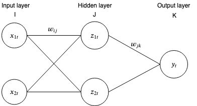

# Backpropagation algorithm

Backpropagation is a technique used to teach a neural network that has at least one hidden layer. 

## This is part 2 of a series of github repos on neural networks

- [part 1 - linear associative network](https://github.com/gokadin/ai-linear-associative-network)
- part 2 - backpropagation (**you are here**)

## Table of Contents

- [Theory](#theory)  
  - [Introducing the perceptron](#introducing-the-perceptron)
  - [Backpropagation](#backpropagation)
    - [Notation](#notation)
    - [The forward pass](#the-forward-pass)
    - [The backward pass](#the-backward-pass)
  - [Algorithm summary](#algorithm-summary)
- [Code example](#code-example)
- [References](#references)

## Theory

### Introducing the perceptron

A perceptron is the same as our artificial neuron from part 1 of this series, expect that it has an activation threshold. 

#### Activation functions

If  then typical activation functions are:

- Sigmoid

- ReLU or rectified linear unit

- tanh

### Backpropagation

The backpropagation algorithm is used to train artificial neural networks, more specifically those with more than two layers. 

It's using a forward pass to compute the outputs of the network, calculates the error and then goes backwards towards the input layer to update each weight based on the error gradient. 

#### Notation

 being the current association out of  associations. 

We will assign the following activation functions to each layer perceptrons:

- input layer -> identity function
- hidden layer -> sigmoid function
- output layer -> identity function

#### The forward pass

During the forward pass, we feed the inputs to the input layer and get the results in the output layer. 

The input to each perceptron in the hidden layer  is the sum of all perceptron of the previous layer times their corresponding weight:

However, since our hidden layer's activation function for each perceptron is the sigmoid, then their output will be: 

In the same manner, the input to the output layer perceptrons are

and their output is the same since we assigned them the identity activation function. 

Once the inputs have been propagated through the network, we can calculate the error:

#### The backward pass

Now that we have the error, we can use it to update each weight of the network by going backwards layer by layer. 

We know from *part 1* that the change of a weight is the negative of that weight's component in the error gradient times the learning rate. For a weight between the last hidden layer and the output layer, we then have

We can find the error gradient by using the chain rule

 where 

Similarily, for a weight between hidden layers, in our case between the input layer and our first hidden layer, we have

 where 

Here the calculations are *slightly* more complex. Let's analyse the delta term  and understand how we got there. We start by calculating the partial derivative of  in respect to the error by using the chain rule

 and 

Remember that our activation function  is the sigmoid function and that its derivative is 

The change of a weight for  associations is the accumulation of each association

### Algorithm summary

...

## Code example

under construction...

## References

- Artificial intelligence engines by James V Stone (2019)
- http://neuralnetworksanddeeplearning.com/chap2.html
- https://google-developers.appspot.com/machine-learning/crash-course/backprop-scroll/