# Backpropagation algorithm

Backpropagation is a technique used to teach a neural network that has at least one hidden layer. 

## This is part 2 of a series of github repos on neural networks

- [part 1 - simplest network](https://github.com/gokadin/ai-simplest-network)
- part 2 - backpropagation (**you are here**)
- [part 3 - backpropagation-continued](https://github.com/gokadin/ai-backpropagation-continued)
- [part 4 - hopfield networks](https://github.com/gokadin/ai-hopfield-networks)

## Table of Contents

- [Theory](#theory)  
  - [Introducing the perceptron](#introducing-the-perceptron)
    - [Activation functions](#activation-functions)
  - [Backpropagation](#backpropagation)
    - [Notation](#notation)
    - [The forward pass](#the-forward-pass)
    - [The backward pass](#the-backward-pass)
  - [Algorithm summary](#algorithm-summary)
  - [Visualizing backpropagation](#visualizing-backpropagation)
    - [Forward pass](#forward-pass)
    - [Backward pass](#backward-pass)
- [Code example](#code-example)
- [References](#references)

## Theory

### Introducing the perceptron

A perceptron is a processing unit that takes an input $x$, transforms it using an activation function $f$ and outputs the result $y$. 

Within a neural network, its input is the sum of the previous layer node outputs times their corresponding weight, plus the previous layer bias unit times its weight:

$$ x_j = \sum^I_{i = 1} x_iw_{ij} + b_iw_{ij} $$

If we treat the bias as an additional node in a layer with a constant value of $-1$, then we can simplify the equation:

$$ x_j = \sum^{I + 1}_{i = 1} x_iw_{ij} $$

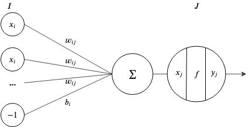

#### Activation functions

Why do we need an activation function? Without it the output of every node will be linear, making the neural network output a linear function of the inputs. Since the combination of two linear functions is also a linear function, you can't compute more interesting functions without non-linear ones. This means that the network will only be able to solve problems that can be solved with linear regression. 

If $x = \sum{\vec{x}\vec{w}}$ then typical activation functions are:

- Sigmoid $\quad y = \frac{1}{1 + e^{-x}}$
- ReLU or rectified linear unit $\quad y = max(0, x)$
- tanh $\quad y = tanh(x)$

### Backpropagation

The backpropagation algorithm is used to train artificial neural networks, more specifically those with more than two layers. 

It's using a forward pass to compute the outputs of the network, calculates the error and then goes backwards towards the input layer to update each weight based on the error gradient. 

#### Notation

- $x_i, x_j, x_k$, are inputs to a node for layers $I, J, K$ respectively. 
- $y_i, y_j, y_k$, are the outputs from a node for layers $I, J, K$ respectively. 
- $y\prime_k$ is the expected output of a node of the $K$ output layer. 
- $w_{ij}, w_{jk}$ are weights of node connections from layer $I$ to $J$ and from layer $J$ to $K$ respectively.
- $t$ is the current association out of $T$ associations. 

We will assign the following activation functions to each layer nodes for all following examples:

- input layer -> identity function
- hidden layer -> sigmoid function
- output layer -> identity function

#### The forward pass

During the forward pass, we feed the inputs to the input layer and get the results in the output layer. 

The input to each node in the hidden layer $x_{jt}$ is the sum of the output from all nodes of the input layer times their corresponding weight:

$$x_{jt} = \sum_{i = 1}^{I} w_{ij}y_{it}$$

Since the hidden layer's activation function for each node is the sigmoid, then their output will be: 

$$ y_{jt} = f_j(x_{jt}) = \frac{1}{1 + e^{-x_{jt}}} $$

In the same manner, the input to the output layer nodes are

$$ x_{kt} = \sum^{J}_{j = 1} w_{jk}y_{jt} $$

and their output is the same since we assigned them the identity activation function. 

$$ y_{kt} = f_k(x_{kt}) = x_{kt} $$

Once the inputs have been propagated through the network, we can calculate the error. If we have multiple associations, we simply sum the error of each association. 

$$ E = \sum^{T}_{t = 1} E_t = \frac{1}{2} \sum^{T}_{t = 1} (y_{kt} - y\prime_{kt})^2 $$

#### The backward pass

Now that we have the error, we can use it to update each weight of the network by going backwards layer by layer. 

We know from *part 1* of this series that the change of a weight is the negative of that weight's component in the error gradient times the learning rate. For a weight between the last hidden layer and the output layer, we then have

$$ \Delta w_{jkt} = -\epsilon \frac{\partial E_t}{\partial w_{jk}} $$

We can find the error gradient by using the chain rule

$$ \frac{\partial E_t}{\partial w_{jk}} = \frac{\partial E_t}{\partial x_{kt}} \frac{\partial x_{kt}}{\partial w_{jk}} $$

$$ \frac{\partial E_t}{\partial x_{kt}} = \frac{\partial E_t}{\partial y_{kt}} \frac{\partial y_{kt}}{\partial w_{jk}} = \frac{\partial}{\partial y_{kt}} \left(\frac{1}{2}(y_{kt} - y\prime_{kt})^2\right) \frac{\partial}{\partial w_{jk}} \left(y_{jt}w_{jk}\right) = y_{kt} - y\prime_{kt} = \delta_{kt} $$

$$ \frac{\partial x_{kt}}{\partial w_{jk}} = \frac{\partial}{\partial w_{jk}}(y_{jt}w_{jk}) = y_{jt} $$

Therefore the change in weight is $\Delta w_{jkt} = -\epsilon \delta_{kt}y_{jt}$

For multiple associations, then the change in weight is the sum of each association $\Delta w_{jk} = -\epsilon \sum^T_{t = 1} \delta_{kt}y_{jt}$

Similarly, for a weight between hidden layers, in our case between the input layer and our first hidden layer, we have

$$ \Delta w_{ijt} = -\epsilon \frac{\partial E_t}{\partial w_{ij}} $$

$$ \frac{\partial E_t}{\partial w_{ij}} = \frac{\partial E_t}{\partial x_{jt}} \frac{\partial x_{jt}}{\partial w_{ij}} = \delta_{jt} y_{it} \quad where \quad \delta_{jt} = y_{jt} (1 - y_{jt}) \sum^K_{k = 1} \delta_{kt} w_{jk}  $$

Here the calculations are *slightly* more complex. Let's analyze the delta term $\delta_{jt}$ and understand how we got there. We start by calculating the partial derivative of $x_{jt}$ in respect to the error by using the chain rule

$$ \frac{\partial E_t}{\partial x_{jt}} = \frac{\partial E_t}{\partial y_{jt}} \frac{d y_{jt}}{dx_{jt}} $$

$$ \frac{\partial E_t}{\partial y_{jt}} = \sum^K_{k = 1} \frac{\partial E_t}{\partial x_{kt}} \frac{\partial x_{kt}}{\partial y_{jt}} = \sum^K_{k = 1} \delta_{kt} w_{jk} \quad and \quad \frac{dy_{jt}}{dx_{jt}} = f'(x_{jt}) = f(x_{jt})(1 - f(x_{jt})) = y_{jt}(1 - y_{jt}) $$

Remember that our activation function $f$ is the sigmoid function and that its derivative is $f(x)(1 - f(x))$

Again, the change in weight for all associations is the sum of each association $\Delta w_{ij} = -\epsilon \sum^T_{t = 1} \delta_{jt} y_{it}$

### Algorithm summary

First, initialize network weights to a small random value. 

Repeat the steps below until the error is about 0​

- for each association, propagate the network forward and get the outputs
  - calculate the $\delta$ term for each output layer node ($\delta_k = y_{kt} - y\prime_{kt}$)
  - accumulate the gradient for each output weight ($\nabla_{w_{jkt}}E_t = \delta_{kt} y_{jt}$)
  - calculate the $\delta$ term for each hidden layer node ($\delta_j = y_{jt}(1 - y_{jt})\sum^K_{k = 1}\delta_{kt} w_{jk}$)
  - accumulate the gradient for each hidden layer weight ($\nabla_{w_{ijt}}E_t = \delta_{jt} y_{it}$)
- update all weights and reset accumulated gradients ($w = w - \epsilon \nabla E$)

### Visualizing backpropagation

In this example, we'll use actual numbers to follow each step of the network. We'll feed our 2x2x1 network with inputs $[1.0, 1.0]$ and we will expect an output of $[0.5]$. To make matters simpler, we'll initialize all of our weights with the same value of $0.5$. However, keep in mind that normally weights are initialized using random numbers. We will also design the network with a sigmoid activation function for the hidden layer and the identity function for the input and output layers and we'll use $\epsilon = 0.01$ as our learning rate. 

#### Forward pass

We start by setting all of the nodes of the input layer with the input values; $x_1 = 1.0, x_2 = 1.0$. 

Since the input layer nodes have the identity activation function, then $y_i = x_i = 1.0$. 

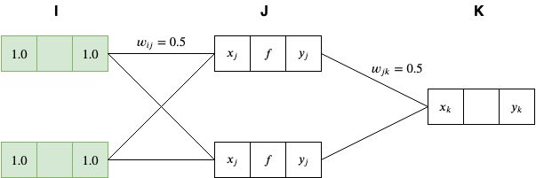

We then propagate the network forward by setting the $J$ layer node inputs ($x_j$) with the sum of all of the previous layer node outputs times their corresponding weights:

$$ x_j = \sum^I_{i = 1} y_i w_{ij} = 1.0 * 0.5 + 1.0 * 0.5 = 1.0 $$

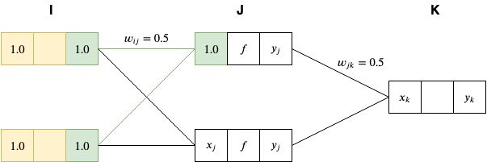

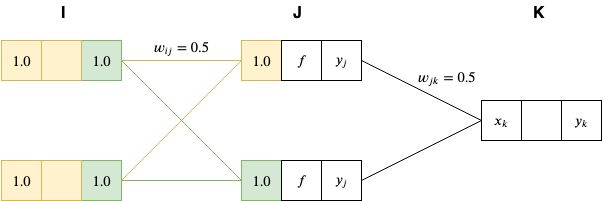

We then activate the $J$ layer nodes by passing it's inputs to the sigmoid function $f(x) = \frac{1}{1 + e^{-x}}$

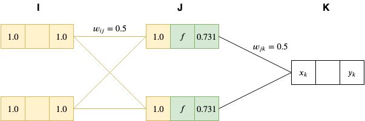

And we propagate those results to the final layer $x_k = 0.731 * 0.5 + 0.731 * 0.5 = 0.731$

Since the activation function of our output nodes is the identity, then $y_k = x_k = 0.731$

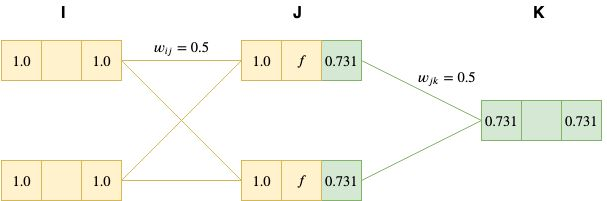

#### Backward pass

On the way back, we first calculate the $\delta$ term for the output node, $\delta_k = y_k - y\prime_k = 0.731 - 0.5 = 0.231$

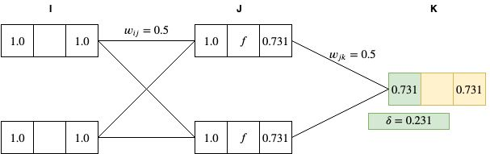

And using the $\delta$ term we calculate the gradient for each weight between $J$ and $K$ layer nodes: $\nabla_{w_{jk}}E = \delta_k y_j = 0.231 * 0.731 = 0.168861$

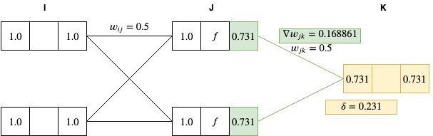

We then do the same thing for each hidden layer (just the one in our case): $\delta_j = y_j(1 - y_j) \sum^K_{k = 1} \delta_k w_{jk} = 0.731 * (1 - 0.731) * (0.5 * 0.231) \approx 0.0227$

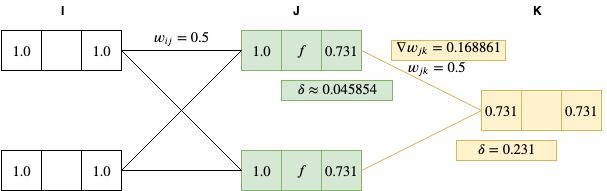

And calculate the gradient for each weight between $I$ and $J$ layer nodes: $\nabla_{w_{ij}}E = \delta_j y_i = 0.0227 * 1.0 = 0.0227$

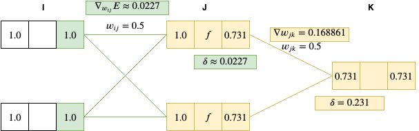

The last step is to update all of our weights using the calculate gradients. Note that if we had more than one association, then we would first accumulate the gradients for each association and then update the weights. 

$w_{ij} = w_{ij} - \epsilon \nabla_{w_{ij}}E = 0.5 - 0.01 * 0.0227 = 0.499773$

$w_{jk} = w_{jk} - \epsilon \nabla_{w_{jk}}E = 0.5 - 0.01 * 0.168861 = 0.49831139$

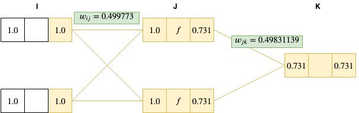

As you can see the weights changed by a very little amount, but if we were run a forward pass again using the updated weights, we should normally get a smaller error than before. Let's check...

We had $y_1 = 0.731$ on our first iteration and we get $y \approx 0.7285$ after the weight changes. 

We had $y_1 - y\prime_1 = 0.231$ and we get $y_2 - y\prime_2 = 0.2285$ after the weight changes. 

We successfully reduced the error! Although these numbers are very small, they are much more representative of a real scenario. Running the algorithm many times over would normally reduce the error down to almost 0 and we'd have completed training the network. 

## Code example

The example teaches a 2x2x1 network the XOR operator. 

$$ x = \begin{bmatrix}
    1.0 & 1.0 & 0.0 & 0.0 \\
    1.0 & 0.0 & 1.0 & 0.0 \\ 
\end{bmatrix} \quad y\prime = \begin{bmatrix}
    0.0 & 1.0 & 1.0 & 0.0 \\
\end{bmatrix} $$

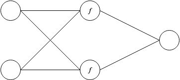

Where $f$ is the sigmoid function for the hidden layer nodes. 

Note that the XOR operation could not be solved with the linear network used in *part 1* because the dataset is distributed non-linearly. Meaning you could not pass a straight line between the four XOR inputs to divide them into the correct two categories. If we replaced the hidden layer node activation functions from sigmoid to identity, this network wouldn't be able to solve the XOR problem as well. 

Feel free to try it out yourself and experiment with different activation functions, learning rates and network topologies. 

## References

- Artificial intelligence engines by James V Stone (2019)
- Complete guide on deep learning: http://neuralnetworksanddeeplearning.com/chap2.html
- Flow of backpropagation visualized: https://google-developers.appspot.com/machine-learning/crash-course/backprop-scroll/
- Activation functions: https://medium.com/the-theory-of-everything/understanding-activation-functions-in-neural-networks-9491262884e0